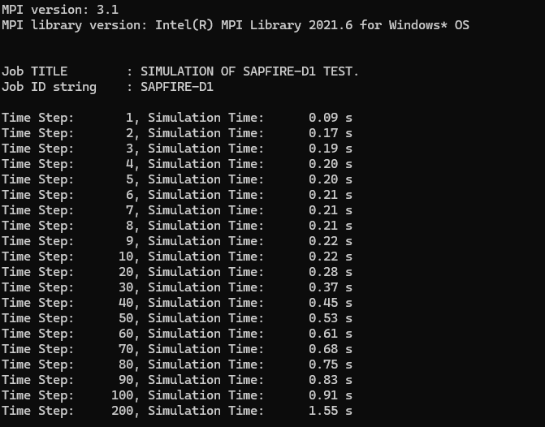
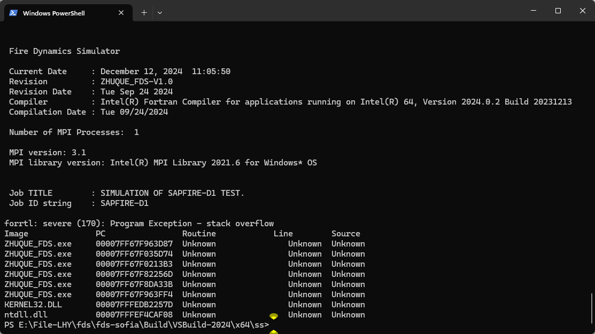
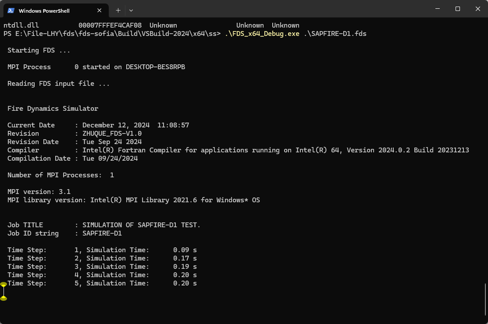
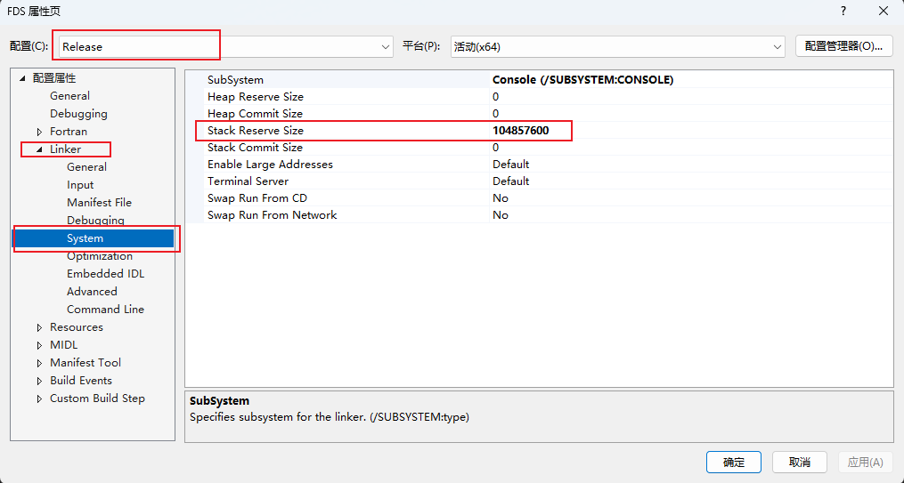
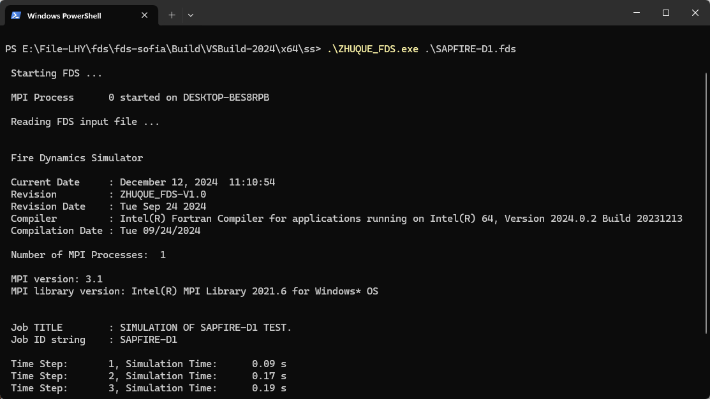

# Fortran语法学习

## TYPE类

1. `TYPE(THERMO_DATA_TYPE), TARGET, DIMENSION(-1:367)` 是一种Fortran语言中的声明语法，用于**定义变量的类型、目标和维度范围**。

- `THERMO_DATA_TYPE` 表示变量的数据类型为热力学数据类型。
- `TARGET` 表示该变量是一个目标（或者可以理解为指向某个存储位置的**指针**）。
- `DIMENSION(-1:367)` 表示该变量是一个数组，且数组索引的范围是从 -1 到 367。

2. `THERMO_DATA(268)%NAME` 是一种 Fortran 语言中的表达式，通常用于**访问一个数组中特定元素的属性或数据**。

在这个表达式中：

- `THERMO_DATA` 是一个**数组**，表示存储热力学数据的数组。
- `(268)` 表示数组中的**索引值**，指定要访问的特定元素。在这里是第 268 个元素。
- `%NAME` 则表示要获取该数组元素的 `NAME` 属性（假设数组元素是一个结构体或具有属性的数据类型）。这表示我们希望获取 `THERMO_DATA` 数组中第 268 个元素的 `NAME` 属性。

一个基本的类：

```fortran
type :: Person
	character(20) :: name
end type Person
```

派生类：

```fortran
type(Person) :: some_person
	some_person = Person('Jill')
print *, some_person % name
```

将某个程序绑定到派生类上，使其成为一个类型绑定的**方法**：

```fortran
type :: Person
	character(20) :: name
contains
	procedure, pass(self) :: greet
end type Person
```

```fortran
subroutine greet(self)
	...
end subroutine greet
```

即可对每一个`Person`实例使用`greet()`方法：

```fortran
type(Person) :: some_person
	some_person = Person('Bob')
call some_person % greet()
```

将派生类型与指向相同类型组件的**指针**结合起来是构建链表的流行方式。

`trim(some_person % name)`是用来移除字符串末尾空格的函数。

### Binding procedures to a derived type  

除了在类型组件中存储任意数据外，还可以将函数和子例程绑定到类型，使它们成为类型绑定方法。与自定义构造函数过程类似，定义类型绑定方法有两个步骤。第一个是**定义函数或子例程本身**，第二个是**在类型定义块中指定绑定**。

```fortran
subroutine greet(self)
class(Person), intent(in) :: self                         !输入参数即为类型实例本身
print *, 'Hello, my name is ' // trim(self % name) // '!'
end subroutine greet
```

声明class(Person)而不是type(Person)，允许将从Person扩展(派生)的任何类型传递 给此子例程。

第二步涉及到实际的绑定——将过程附加到类型 ，以便在使用类型实例的任何地方都可以使用它。我们将在派生类型定义中绑定过程 ，紧跟在`contains`语句之后:

```fortran
type :: Person
...
contains
procedure, pass(self) :: greet
end type Person
```

在Fortran中，`procedure, pass(self) :: get_age` 是一种类型绑定的定义语法，用于与面向对象编程相关的自定义数据类型。具体含义如下：

- `procedure` 关键字表示接下来将声明一个过程（procedure）。
- `pass(self)` 表示该过程将会接受一个称为self的隐式参数，这是一种用于指代调用所属对象的常见命名约定。
- `:: get_age` 表示将一个名为get_age的过程与当前类型进行绑定。

### 控制对类型组件和方法的访问

两大原则：

1. 如果在声明中没有指定`private`或`public`属性，则默认情况下所有组件和方法都是公共的。
2. 派生类型定义中的单个`private`语句意味着在默认情况下将所有以下组件声明为`private`。对于单个`public`语句也是如此。

对于私有类型组件，一个有趣的警告是，它们不可能使用默认类型构造函数。

```fortran
type :: Person
character(len=20) :: name
integer, private :: age
end type Person
```

以下两种初始化都不予通过：

```fortran
!1
type(Person) :: some_person
some_person = Person('Jill', 32)

!报错
derived_type_private_error.f90:12:16:
some_person = Person('Jill', 32)
1
Error: Component ‘age’ at (1) is a PRIVATE component of ‘person’

!2
some_person = Person('Jill')

!报错
derived_type_private_error.f90:12:16:
some_person = Person('Jill')
1
Error: No initializer for component ‘age’ given in the structure constructor
at (1)
```


## intent

<font songti color="red">Fortran在向函数块传递参数时并非值传递，而是地址传递</font>，因此在函数块内修改变量的值会使得主调函数中的变量的值也发生改变，因此有时我们需要将形参声明为只读，以保证主调函数端的变量值不发生改变。这时就需要用到**`intent`关键字**。intent用于修饰形参的属性，常在函数块中定义(声明)形参时出现，形参的属性可声明为以下三种：

- intent(in) 将变量声明为**只读**，若在函数块中修改了其值，编译时会报错
- intent(out) 将变量指定为要输出的变量，若在函数块中没有赋一个新的值给它，则编译时会报错
- intent(inout) 将变量声明为**可读可写的变量**，当**intent缺省时默认为intent(inout)**

## 纯函数

在Fortran中，`pure integer function get_age(self)` 是一个函数声明语句，表示定义了一个纯函数（pure function），用于返回整数类型的年龄值。具体含义如下：
- `pure` 关键字表示该函数是一个纯函数，即它**不会修改任何全局变量或进行任何IO操作，其结果仅取决于输入参数**。
- `integer` 表示该函数将返回一个整数值。
- `function` 表示这是一个函数声明。
- `get_age` 是函数的名称，可根据需要更改为其他名称。
- `(self)` 表示函数可能接收一个自定义类型的实例作为输入参数。这个self参数通常用来表示当前对象的实例，类似于面向对象编程中的this指针。

因此，该函数声明定义了一个纯函数 `get_age`，它将返回一个整数值，并且可能接收一个自定义类型的实例作为输入参数。

## 操作符

### =>

在Fortran中，`=>` 是一个用于进行**过程关联的操作符**。在这个上下文中，`procedure :: init => init_people` 表示将一个过程 `init_people` 与另一个过程 `init` 进行关联。

具体含义如下：

- `procedure :: init` 表示声明一个名为 `init` 的过程。
- `=> init_people` 表示将 `init` 这个过程与 `init_people` 这个过程进行关联（或者说将 `init` 变量指向 `init_people` 过程）。

## 变量类型

```fortran
INTEGER, PARAMETER :: QB = SELECTED_REAL_KIND(33,4931)
```

这行代码声明了一个名为QB的整数参数，其值为selected_real_kind(33,4931)所选择的实数精度级别。在这里，**33是指有效数字位数，4931是指指数范围**。这将用于定义具有所需精度和范围的实数类型。

```fortran
INTEGER, PARAMETER :: EB = SELECTED_REAL_KIND(12, 90)
```

这段代码声明了一个名为EB的整数参数，其值为selected_real_kind(12)选择的实数精度级别。这个语句将设置实数的精度为**至少12位有效数字**。**EB表示给定的十进制精度p和十进制指数范围r所需的类型参数值**（即，要满足至少12位有效数字，十进制指数至少为r所需的kind值）。

```fortran
SELECTED_INT_KIND(n)	!返回如果想要记录n位整数时，所应声明的kind值。返回-1时，表示无法提供所想要的至于范围
```

## 函数function

函数定义、调用和返回？

函数与子例程一样, 也是一种封装代码的方式, 但是与子例程不同的是, 函数有**返回值**。即函数内的代码块运行结束后, 可以返回一个值作为该函数的`值`。

函数在定义时也需要像子例程一样给定每一个传入参数的数据类型。
特别的，函数还需要给出返回值的数据类型, 且**返回值的变量名称与函数的名称一致**。

**函数定义时可以在定义时直接表明返回值类型**

```fortran
integer function add(a, b)
    integer :: a, b
    add = a + b

end function
program add_demo
    implicit none
    integer :: a, b
    integer :: add
    write(*, *) "Input two integer splited by space>>>"
    a=2 
    b=4
    write(*, *) add(a, b)
end program add_demo
```

**函数定义时也可以指定一个变量来表示其返回值**

需要使用`result`语句

```fortran
integer function add(a, b) result(r)
    integer :: a
    integer :: b
    integer :: r
    r = a + b
end funciton
```

### interface

对于满足下面条件的`subroutine/function`, 由于其参数或是返回值比较特殊, 需要在使用之前告诉编译器其返回值或各个参数的定义, 称为接口`interface`

```fortran
interface
    function subroutine_name(args)
        arg_type, arg_declaction :: arg_name
        ...
    end function

    function function_name(args)
        arg_type, arg_decoration         :: arg_name
        return_type, return_decoration   :: function_name
        ...
    end function
end interface
```

需满足：

1. 返回值为数组
2. 存在可选参数
3. 指定参数位置来传参
4. 输入指标参数
5. 返回值为指针

在部分需求下, `function/subroutine`的部分参数有时需要被传入, 有时不需要被传入, 这时就需要用到特殊的修饰词`optional`, 表明该参数是一个可选参数。另外, 可以用`present`函数来检查一个参数是否被传入。

```fortran

program option_demo
    implicit none

    !> This subroutine need interface to use.
    interface

        subroutine useless(number)
            integer, optional :: number
        end subroutine

    end interface

    call useless(10)
    call useless()
end program


subroutine useless(number)
    implicit none
    integer, optional :: number

    if (present(number)) then
        write(*, *) "The optional argument number is :", number
    else
        write(*, *) "The optional argument don't find."
    end if

end subroutine
```

可以使用`optional`实现给参数赋默认值:

```fortran
integer, optional :: a
integer           :: real_a
integer           :: default_value = 5

if (.not. present(a)) then
    real_a = default_value
else
    real_a = a
end if
```

函数的接口信息用于告诉编译器应该如何正确调用该函数，它包括参数和返回值的数量、类型等信息。因此每个函数都必须具有相应的接口信息，缺省情况具有隐式声明，而使用interface则可显式声明函数的接口信息。

Interface 的主要功能：
 1、明确外部函数(external procedure) 或虚函数(dummy procedure)的接口信息，包括：输入输出参数的类型和属性、返回值类型、函数属性；
 2、定义通用过程名，即函数重载(overload)；
 3、操作符(+,-,*,/,et al)和赋值符(=)重载。

#### 接口界面块

 **内部函数(contains)、模块(module)中的函数，以及Fortran标准函数 (如：sind、abs等) 均自动包含显式接口，不需要也不能再次声明接口信息**，因此上述情况不在讨论之中。我们建议将外部函数封装在module中使用。
   外部函数缺省具有隐式接口，对一些常规函数，用户不必显示声明其接口信息，编译器也能正确识别。但当外部函数的形参具有ALLOCATABLE, ASYNCHRONOUS, OPTIONAL, POINTER, TARGET, VALUE, VOLATILE属性时，必须显示声明接口信息。下列情况之一也必须使用接口界面块：

 ● 外部函数返回值为指针、数组或可变长度字符串；
 ● 形参为数组片段；
 ● 参数个数不确定或包含可选参数；
 ● 改变参数传递顺序；
 ● 子程序中扩展了赋值号的使用范围。

   接口界面块的使用较为简单，在接口界面块(interface-end interface)之间写入函数形参类型说明语句，即去掉所有可执行语句后的剩余部分。下面的例子给出了函数返回数组时以及具有可选参数时使用interface的例子：

```fortran
program Fcode_cn
	  integer::i=0, j=1, k=2, m(2)
	  interface  ! 接口块
	    subroutine sub1(i,j,k)
	      integer,optional::k
	      integer i,j
	    end subroutine
	    function func1(j,k)
	      integer j, k
	      integer func1(2)
	    end function
	  end interface
	  m = func1(j,k)
	  print*, m  ! m=3,-1
	  call sub1(i,j,k)
	  print*, i  ! i=3
	  call sub1(i,j)
	  print*, i  ! i=1

	  pause
end

	function func1(j,k)
	  integer j, k
	  integer func1(2)
	  func1(1) = j + k
	  func1(2) = j - k
	end function
	
	subroutine sub1(i,j,k)
	  integer,optional::k
	  integer i,j
	  if( present(k) ) then
	    i = j + k
	  else
	    i = j
	  end if
	end subroutine
```

#### 函数重载

某些情况下，**我们需要对不同类型或不同数量的参数做相似或相同的操作**，由于参数类型、数量不同，我们需要编写不同的函数来处理。比如求绝对值，如果参数是4字节整数，我们需要调用iabs函数；如果参数是4字节或8字节实数，我们需要分别调用abs或dabs函数。

 由于需要记住多个功能相同或相近的函数，增加了我们使用这些函数的难度，同时也增加了出错的可能性，比如将实数传递给iabs函数。

 **上述函数的功能相同，只是参数类型或个数不同，那么可否使用同一个函数名来执行它们呢？当然可以，这就是函数重载。**函数重载允许通过调用<font color=red>通用过程名</font>来执行特定函数。当用户调用通用过程名时，编译器首先检查传入参数的类型和数量，再调用与之匹配(类型和数量相同)的特定函数来执行具体任务。

 例如我们建立通用过程名abs来求绝对值，用户在任何情况都只需调用abs，编译器会自动选用合适的特定函数执行对应操作：当传入参数是4字节整数，就调用iabs函数；如果是8字节实数，则调用dabs函数。

 下面用求绝对值的例子说明函数重载功能。为与Fortran内在函数abs区别开来，我们在函数名后添加“_f”。

```fortran

module abs_module
  implicit none
  interface abs_f
  module procedure abs_f, dabs_f, iabs_f
  end interface
contains
function abs_f(x)
real(4) abs_f, x
if( x<0.0_4 ) then
  abs_f = -x
else
  abs_f = x
end if
end function abs_f
 
function dabs_f(x)
real(8) dabs_f, x
if( x<0.0_8 ) then
  dabs_f = -x
else
  dabs_f = x
end if
end function dabs_f
 
function iabs_f(x)
integer(4) iabs_f, x
if( x<0 ) then
  iabs_f = -x
else
  iabs_f = x
end if
end function iabs_f
end module abs_module
 
program Fcode_cn
use abs_module
real(4):: x=-2.0_4
real(8):: y=-3.0_8
integer(4)::z=-4
 
print*, abs_f(x)
print*, dabs_f(y), abs_f(y)
print*, iabs_f(z), abs_f(z)
 
pause
end
```

执行结果：
 2.000000
 3.00000000000000 3.00000000000000
 4 4

   代码分析：我们使用interface创建了一个函数重载，其通用过程名(interface之后的标识符)为abs_f，包含三个特定过程abs_f, dabs_f, iabs_f。需要注意，**通用过程名可以与其中一个特定过程名一致，也可以不一致；但特定过程名之间必须不同**。每个特定过程的形参类型和数量不能完全一致。

  interface abs_f
    module procedure abs_f, dabs_f, iabs_f
  end interface

 在程序执行过程中，调用通用过程名时，编译器首先检查实参的类型和数量，并与特定过程的接口信息相匹配。如果匹配成功，则调用相应特定函数(故dabs_f(y)和abs_f(y)的结果是一致的)；否则编译器会报错。

 比如调用 abs_f(12_8), 由于我们没有给出针对8字节整数求绝对值的特定函数，编译器则会报错。

#### 操作符和赋值符(=)重载

常规运算中，我们经常用到算术操作符(+,-,*,/,**)、关系操作符(<,<=,>,>=,==,/=)以及赋值符(=)，同时也会发现其使用具有一定的局限性：只能对特定的数据类型进行运算，不能直接用于派生数据类型。

 比如两个时间相减，我们不能直接使用“-”进行操作，而需要编写特定的函数。针对这一问题，Fortran90引入了操作符重载功能。我们先看下面一段代码：

```fortran
module time_class
  implicit none
  type time  !定义一个时间类结构体
    integer(1) hour, minute, second
  end type
  interface operator(-) !重载操作符-
    module procedure timeMinus
  end interface
  interface assignment(=) !重载赋值符=!!!!!!!!!!!!!!!!!!
    module procedure assign_time
  end interface
  interface operator(.minus.) !自定义操作符.minus.
    module procedure timeMinus
  end interface
contains
! 两个时间相减
function timeMinus(time1,time2)
type(time),intent(in)::time1, time2
type(time) timeminus
integer n
n=(time1.hour-time2.hour)*3600 + (time1.minute-time2.minute)*60 + (time1.second-time2.second)
if(n<0) n=n+3600*24
timeminus.second=mod(n,60)
n=n/60
timeminus.minute=mod(n,60)
timeminus.hour=n/60
end function
! 如果time类数据正确，将其赋值给res；否则输出错误提示
subroutine assign_time(res,time1)
type(time),intent(in):: time1
type(time),intent(out):: res
if(time1.hour>=0 .and. time1.hour<=23) then
  if(time1.minute>=0 .and. time1.minute<=59) then
    if(time1.second>=0 .and. time1.second<=59) then
      res.hour=time1.hour
      res.minute=time1.minute
      res.second=time1.second
      return
    end if
  end if
end if
write(*,*) "time类数据错误."
end subroutine
end module
 
program fcode_cn
  use time_class
  type(time) time1,time2,time3
  time1=time(2,3,58)
  time2=time(23,12,7)
  time3=time2-time1 !重载操作符-
  print*,time3
  time2=time3 .minus. time1 !自定义操作符.minus.
  print*,time2
  time1=time(25,5,6) !重载赋值符=
pause
end
```

模块time_class中定义了一个时间类结构体以及两个函数，函数timeMinus用于操作符“-”重载和自定义操作符，子程序assign_time用于赋值符“=”重载。注意，**<font color=red>操作符重载只能使用function，而赋值符重载只能使用subroutine，自定义操作符需位于两个dot之间</font>**。

 程序一开始使用赋值符重载功能对time1和time2进行赋值，由于数据无误，正常执行；
 接下来，分别使用重载操作符“-”和自定义操作符“.minus.”进行两个时间相减，得到相应结果；
 最后对time1赋值时，由于数据有误，输出错误提示。

 执行结果：

 21 8 9
 19 4 11

 Time类数据错误.

### PURE 函数

pure函数是一类支持并行运算的函数, 它的运算速度比普通函数快, 只需要在 subroutine/function前面增加 pure, 但是为了支持并行运算, pure函数必须满足以下全部条件:

    所有的参数为intent(in)
    每个参数都要赋值属性
    不能使用SAVE
    调用的函数也必须为pure函数
    不能使用STOP及输入输出相关的语句
    不能改变全局变量的值

如果不满足上述条件, 在并行运算时会出现多线程同时修改、同时打印导致程序不稳定或是出现意想不到的结果。
**COMMON**

有时, 部分变量在整个程序运行过程中需要被多个子历程或是函数读取或是修改, 每一次都传递参数过于麻烦, `fortran` 提供了 `common` 语句来申明全局变量。

```fortran
program common_demo
    implicit none
    integer :: a, b
    common a, b
    call print_number()
    a = 1
    b = 2
    call print_number()

end program


subroutine print_number()
    implicit none
    integer :: n1, n2
    common n1, n2
    write(*, *) n1, n2
end subroutine
```


### epsilon函数

对于实数$x$, `Epsilon (x)`返回与$x$具有相同类型参数的实数结果，与包含$x$的模型中的值1.0相比几乎可以忽略不计，即$ b^{1−p}$。

通俗来讲，即为计算与$x$具有相同类型的最小值，使得$1+\epsilon>x$。

## implicit none

<font color=red>历史遗留问题</font>

Fortran程序中难以检测的一个错误来源是在无法访问显式接口的情况下调用需要显式接口的过程。类似地，当打算使用模块过程时，也很难找到调用外部过程的方法。发生这种情况**是因为使用名称作为过程隐式地声明它是一个过程**；为了更容易检测此类错误，现在可以禁用此隐式声明。

`implicit none[([implicit-none-spec-list])]`的语法可以避免此类问题。

其中`implicit-none-spec-list`为`external`或`type`，每个限定符最多出现一次。

`external`要求引用的任何`procedure`要么具有显式接口，要么声明为`external`。

`type`的出现要求显式声明所有数据实体的类型， 与`implicit none`一样，没有任何限制。

- `implicit none` is equivalent to `implicit none ( type )`

在 Fortran 语言中，`implicit none` 语句是一个非常重要的编程实践，它用于关闭隐式类型声明。这意味着，除非显式声明，否则编译器不会为变量分配数据类型。使用 `implicit none` 有以下几个主要原因：

1. **防止错误**：在没有 `implicit none` 的情况下，Fortran 编译器会根据变量名的第一个字母隐式地为变量分配类型（例如，以字母 `I` 到 `N` 开头的变量默认为整数类型，而 `O` 到 `Z` 则默认为实数类型）。这种隐式类型分配可能会导致难以发现的错误，因为程序员可能会错误地认为变量是另一种类型。
2. **提高代码的可读性和可维护性**：当所有的变量都显式声明时，代码更容易理解和维护。其他程序员（或未来的你）可以快速查看变量声明，了解每个变量的类型和用途，而不需要猜测编译器会如何解释变量名。
3. **避免命名冲突**：在大型项目中，可能会有多个模块和子程序。如果没有 `implicit none`，不同模块中相同名称的变量可能会因为隐式类型声明而具有不同的类型，这会导致难以追踪的错误。
4. **提高代码的可移植性**：不同的 Fortran 编译器可能对隐式类型声明有不同的实现。使用 `implicit none` 可以确保代码在不同的编译器和平台上具有一致的行为。
5. **提高编译器的优化能力**：当编译器知道所有变量的确切类型时，它可以更有效地优化代码。隐式类型声明可能会限制编译器的优化能力。
6. **符合现代编程标准**：随着编程语言的发展，现代编程语言通常要求显式类型声明。使用 `implicit none` 符合现代编程的最佳实践。
7. **减少编译警告和错误**：在许多情况下，编译器会发出关于隐式类型声明的警告。使用 `implicit none` 可以消除这些警告，使得编译过程中的错误更容易被发现和解决。

在Fortran 2018中，`IMPLICIT NONE (TYPE,EXTERNAL)`与传统的`IMPLICIT NONE`有所不同。`IMPLICIT NONE`用于禁止隐式声明所有变量，要求显式声明每个变量。而`IMPLICIT NONE (TYPE,EXTERNAL)`则不仅禁止隐式声明变量，还明确规定类型和外部名称的隐式声明规则。这意味着类型和外部变量也必须显式声明，不允许使用隐式类型或外部程序或函数。

## 模块

在 Fortran 中，模块（module）中的变量默认是public的，这意味着它们可以被模块外部的程序单元直接访问。

如果你想让模块中的变量在模块外部可用，你需要使用 `public` 关键字来声明这些变量。这样，使用 `use` 语句引入模块的其他程序单元就可以访问这些公共变量了。

### 模块的定义：

```fortran
module module_name
    ...     ! variable, type and cosntant
contains
    ...     ! subroutine, function
end module [module_name]
```

#### contains

在 Fortran 中，`contains` 关键字用于指示模块（module）或程序单元（如子程序或函数）的内部部分的开始。它通常用于将模块内部的辅助子程序或函数与模块的主体部分分隔开。使用 `contains` 可以将模块的内部逻辑组织得更加清晰，并且可以隐藏实现细节。

`contains` 是 Fortran 编程中用于模块化和代码组织的重要工具，它有助于创建结构清晰、易于维护的代码。

### 模块的使用：

`fortran` 中 `funciton/subroutine/program`都可以使用 `use` 语句来使用指定的模块。

<font songti color="red">**注意**</font>：

> `use`语句需要出现在`implicit` 语句之前。
> 当模块被使用后, 模块中定义的所有代码块将<font songti color="red">**引用**</font>进当前作用域。

### 指定引用

为了避免变量名冲突, 引用模块时可以**只引用部分内容或是给模块内变量更改名称**, 需要使用到`only`语句。

```fortran
module m_paramater
    implicit none
    real, parameter :: pi = acos(-1.)
    real, parameter :: ep = exp(1.)   
    integer :: prime_numbers_less_then_ten(4) = [2, 3, 5, 7]
end module
program main
    use m_paramater, only: pi			! 仅引用部分变量
    implicit none
    write(*, *) pi
end program
```

### 重命名

有的模块中定义的变量可能和程序需要使用的变量同名, 这时可以用`=>`将其改名。

```fortran
use m_paramater, only: constants_pi => pi
```

`=>`后面指向的是模块中的名字, 前面是重命名的名字。

### 模块成员管理

部分模块中的函数或是变量由于安全性问题, 不便于暴露给外部使用, 不希望或是不能被外部修改, 这时可以用`private`或是`public`关键字来指明模块中的内容是否暴露给外部, 默认情况下, 模块的所有成员都是`public`的, 也就是外部可以任意进行调用。
被`private`修饰的成员称为私有成员,` public`修饰的成员称为公共成员。

如，可以使用`private`关键字隐藏模块中的部分成员：

```fortran
module m_paramater
    implicit none
    real, parameter, private :: pi = acos(-1.)			!模块中声明为私有变量，无法外部调用
    real, parameter :: ep = exp(1.)   
    integer :: prime_numbers_less_then_ten(4) = [2, 3, 5, 7]
end module
program main
    use m_paramater
    implicit none
    write(*, *) pi
end program
```

也可以直接使用`private`关键字来改变模块成员默认是否暴露如：

```fortran
module m_name
    private
    integer :: a, b, c
    integer, public :: d
end module
```

此时模块中的所有变量默认都是`私有的`，即`a, b, c`不会暴露给外部， `d`暴露给外部。

<font songti color="red">**注意**</font>：在模块中编写的`function/subroutine`不需要编写接口,<font songti color="red"> **因此, 一种良好的编程习惯是: 所有的`function/subroutine`都要放进`module`中, 不应该有野函数。**</font>
用这样的方式, 既不需要书写`interface`, 也可以更好的管理函数。

## Allocatable

动态数组只有两种：**可分配数组**和**自动数组**。自动数组和可分配数组很类似，区别在于当程序开始或结束时，自动数组会自动分配和释放内存。当用户分配动态存储空间时，数组的大小是在运行时而不是在编译时确定的。动态分配可以用于标量和任何类型的数组。**当用户给数组指定了可分配属性时并没有立即分配内存，而是直到使用ALLOCATE语句后才分配**。随后还可以用`DEALLOCATE`语句释放内存空间，这时数组可以以其它形状或目的来使用。

```fortran
例：INTEGER, ALLOCATABLE :: A(:),B(:)
INTEGER ERR_MESSAGE
ALLOCATE(A(10:25),B(SIZE(A)))
DEALLOCATE(A,B,STAT=ERR_MESSAGE)		!如果指定STAT选项，语句的成功执行时将返回0，否则返回正值。数组不能多次分配，否则报错
IF(ERR_MESSAGE.NE.0) PRINT *,'DEALLOCATION ERROR'
例：INTEGER,DIMENSION(:),ALLOCATABLE :: freq
READ *,limit
ALLOCATE(freq(1:limit))
DEALLOCATE(freq)
```

`ALLOCATABLE`、`ALLOCATE`和`DEALLOCATE`要配合使用。

[Fortran学习笔记7: 数组的高级特性 - 知乎 (zhihu.com)](https://zhuanlan.zhihu.com/p/616779909)

在Fortran中，`real(real32), allocatable`是一个声明语句，用于定义一个可分配的单精度浮点数变量。其中：

- `real` 表示该变量的数据类型为实数（浮点数）。
- `(real32)` 表示指定该实数变量的精度为单精度（32位），而非双精度（64位）或其他精度。
- `allocatable` 表示该变量是可分配的，即它可以在运行时动态分配内存空间来存储数据。

```fortran
real(real32), allocatable :: data(:,:)
```

在Fortran中，`DEALLOCATE`和`NULLIFY`是用于内存管理的两个不同语句，它们在处理动态分配的内存时有着不同的用途和行为：

### DEALLOCATE
`DEALLOCATE`语句用于释放之前使用`ALLOCATE`语句分配的内存。当你使用`ALLOCATE`为一个数组或其他数据结构分配内存后，使用`DEALLOCATE`可以释放这些内存，使其回到可用内存池中。**这对于管理动态内存非常重要**，特别是在创建大型数组或在循环中多次分配和释放内存时。

```fortran
integer, allocatable :: arr(:)
allocate(arr(10))
! ... 使用arr ...
deallocate(arr)
```

在上面的例子中，`arr`是一个可分配的数组，我们为它分配了10个整数的内存空间，使用完毕后通过`deallocate`释放。

### NULLIFY
`NULLIFY`语句用于将指针关联到`NULL`，即断开指针与其指向的内存的联系。**这通常用于防止悬空指针（dangling pointer）的问题**，悬空指针是指那些指向已经被释放或不再有效的内存的指针。**<font color=red>`NULLIFY`不会释放内存，它只是确保指针不再指向任何内存。</font>**

```fortran
integer, pointer :: ptr
allocate(ptr, source = [1, 2, 3])
nullify(ptr)
```

在这个例子中，`ptr`是一个指针，我们为它分配了一个数组并初始化值。使用`nullify`后，`ptr`不再指向任何内存，即使之前分配的内存仍然存在。

### 区别
- **内存释放**：`DEALLOCATE`释放内存，而`NULLIFY`不释放内存，只是将指针置空。
- **用途**：`DEALLOCATE`用于结束对动态分配内存的使用，`NULLIFY`用于避免指针指向无效内存。
- **对内存的影响**：`DEALLOCATE`后，原先分配的内存不再与任何变量关联，而`NULLIFY`后，指针变量变为`NULL`，但内存仍然存在，直到被`DEALLOCATE`或其他机制释放。

在实际编程中，通常需要根据具体情况选择使用`DEALLOCATE`或`NULLIFY`，或者两者结合使用。例如，在一个函数中，你可能先`NULLIFY`一个输出参数的指针，以确保它不会持有任何悬空指针，然后在函数的最后`DEALLOCATE`任何动态分配的内存。这样可以提高程序的健壮性和安全性。

## 指针

在大多数编程语言中，指针变量存储对象的内存地址。 但是，**在Fortran中，指针是一种数据对象，它具有比仅存储内存地址更多的功能**。 **它包含有关特定对象的更多信息，如类型，等级，范围和内存地址**。

1. 使用`pointer`属性声明指针变量。

指针可以指向：

- 动态分配内存的区域。
- 与指针具有相同类型的数据对象，具有**target**属性。

2. **allocate**语句允许您为指针对象分配空间。 例如：

```fortran
program pointerExample
implicit none
   integer, pointer :: p1
   allocate(p1)
   p1 = 1
   Print *, p1				!return 1
   p1 = p1 + 4
   Print *, p1				!return5
end program pointerExample
```

当不再需要时，应该通过**deallocate**语句清空分配的存储空间，并避免累积未使用和不可用的内存空间。

3. target

目标是另一个正常变量，为它留出空间。 必须使用**target**属性声明目标变量。

使用**关联运算符（=>）**将指针变量与目标变量相关联。

```fortran
program pointerExample
implicit none
   integer, pointer :: p1
   integer, target :: t1 
   p1=>t1
   p1 = 1
   Print *, p1		! 1
   Print *, t1		! 1
   p1 = p1 + 4		! 5
   Print *, p1		! 5
   Print *, t1		! 5
   t1 = 8
   Print *, p1		! 8
   Print *, t1		! 8
end program pointerExample
```

## Fortran中循环exit，cycle，stop，goto

Fortran中跳出循环的两个命令为`exit`和`cycle`，`exit`表示跳出离命令最近的循环，`cycle`表示结束此次循环并开始下一次循环。

pause：程序执行到pause 时，会暂停执行，直到用户按下Enter键才会继续执行。

continue这个命令没有实际的用途，它的功能就是继续向下执行程序，相当于python中的pass。

stop用来结束程序执行。

cycle命令可由略过循环的程序模块中，相当于python和C中的continue，直接跳过后面的所有代码，然后开始下一次循环。

exit的功能是可以直接跳出一个正在进行的循环，不论是do 循环还是do while 循环，相当于python和C中的break。

## 内部模块

### ISO_FORTRAN_ENV

1. ERROR_UNIT，标识用于错误报告的预连接外部单元。值为0。

## 文件操作

### REWIND

在Fortran中，**REWIND是一种用于将文件指针重新指向文件开头的操作**。它用于在重新读取文件之前将文件指针重置到文件的起始位置。这通常用于重新开始对文件的读取或写入操作。

以下是一个示例说明REWIND的用法：

```Fortran
PROGRAM Rewind_example
  IMPLICIT NONE

  INTEGER :: i
  CHARACTER(LEN=20) :: line
  INTEGER :: unit_number

  OPEN(unit=10, file='data.txt', status='OLD')   ! 打开一个名为data.txt的文件用于读取
  REWIND(10)   ! 将文件指针重新指向文件开头

  DO i = 1, 5
     READ(10, '(A)') line   ! 逐行读取文件内容并输出
     PRINT *, line
  END DO

  CLOSE(10)   ! 关闭文件

END PROGRAM Rewind_example
```

在这个例子中，我们首先打开一个名为data.txt的文件用于读取（status='OLD'表示文件必须存在）。然后使用REWIND(10)来将文件指针重置到文件开头。接下来，使用一个循环读取文件的前5行内容，并将其打印输出。

通过使用REWIND函数，我们可以方便地将文件指针重新定位到文件的开头，以便再次读取文件内容或重新进行文件操作。**这对于需要重复读取文件内容或进行多次处理的情况非常有用**。

### BACKSPACE

在Fortran中，BACKSPACE是一种用于移动文件指针到上一个记录位置的操作。它通常用于在读取文件时回退到上一个记录的位置，以便重新读取该记录或进行其他操作。

以下是一个示例说明BACKSPACE的用法：

```Fortran
PROGRAM Backspace_example
  IMPLICIT NONE

  INTEGER :: i
  CHARACTER(LEN=20) :: line
  INTEGER :: unit_number

  OPEN(unit=10, file='data.txt', status='OLD')   ! 打开一个名为data.txt的文件用于读取

  DO i = 1, 3
     READ(10, '(A)', END=100) line   ! 逐行读取文件内容并输出
     PRINT *, line
  END DO

  BACKSPACE(10)   ! 回退到上一个记录位置

  READ(10, '(A)') line   ! 再次读取上一个记录
  PRINT *, '再次读取的记录:', line

100 CONTINUE
  CLOSE(10)   ! 关闭文件

END PROGRAM Backspace_example
```

在这个例子中，我们首先打开一个名为data.txt的文件用于读取（status='OLD'表示文件必须存在）。然后使用一个循环，逐行读取文件的前3行内容并将其打印输出。接着使用BACKSPACE(10)将文件指针移动到上一个记录位置，然后再次读取上一个记录并将其打印输出。

通过使用BACKSPACE函数，我们可以在读取文件时回退到上一个记录位置，以便重新读取该记录或进行其他处理。这对于需要回溯到之前记录的情况非常有用。

### 挂靠

Fortran中trim函数：TRIM(filename)//'.stop'，其中//表示挂靠的意思，若filename='abc'，则'abc'//'.stop'就表示abc.stop。

### Inquire

该声明可以判断文件的状态，例如：

Inquire(file=filename,exist=ex)，如果文件存在，则ex为true，反之为false。

### IOSTAT

在 Fortran 中，`IOSTAT` 关键字用于检查 `READ` 或 `WRITE` 语句执行过程中的状态。当与输入/输出语句一起使用时，`IOSTAT` 可以捕获并提供关于输入/输出操作成功或失败的信息。

 `IOSTAT` 的用法：

1. **检查输入/输出状态**：
   `IOSTAT` 后面通常跟随一个整型变量，当 `READ` 或 `WRITE` 语句执行后，**如果操作成功，该变量会被赋值为零。如果操作过程中遇到错误，`IOSTAT` 变量会被赋予一个正数，表示错误代码**。

2. **处理文件结束**：
   **当读取操作到达文件末尾时，`IOSTAT` 变量会被赋予一个负数。**

3. **使用场景**：
   - 在读取数据时，如果不确定文件的长度，可以使用 `IOSTAT` 来检测是否已经到达文件末尾。
   - 在处理输入错误时，可以通过检查 `IOSTAT` 的值来确定是否发生了输入错误，并据此进行错误处理。

 **示例代码**：

```fortran
integer :: ios
open(unit=10, file='data.txt', status='old', iostat=ios)
if (ios /= 0) then
    print *, 'Error opening file'
    stop
endif

read(10, *, iostat=ios) var1, var2
if (ios < 0) then
    print *, 'End of file reached'
    close(10)
    stop
elseif (ios > 0) then
    print *, 'Error reading data'
    close(10)
    stop
endif

close(10, iostat=ios)
if (ios /= 0) then
    print *, 'Error closing file'
    stop
endif
```

在上面的代码中，`ios` 用于捕获 `open`、`read` 和 `close` 操作的状态。如果 `ios` 为正数，则表示输入/输出操作出错；如果 `ios` 为负数，则表示文件结束。

**错误代码含义：**

- **正数**：表示发生错误，不同的值可能代表不同类型的错误。
- **零**：表示操作成功。
- **负数**：表示文件结束。

**注意事项：**

- 使用 `IOSTAT` 时，应检查其值以确定操作是否成功，并据此进行适当的错误处理。
- 在读取操作中，如果 `IOSTAT` 返回负值，表示已经到达文件末尾，此时不应再继续读取操作。
- 在处理输入错误时，应避免使用可能包含无效数据的变量。

通过使用 `IOSTAT`，Fortran 程序可以更加健壮地处理输入/输出操作中可能出现的各种情况。

## ASSOCIATED

`ASSOCIATED(POINTER [, TARGET])`  确定指针  POINTER  的状态或  POINTER  是否与目标  TARGET  关联。

语法：RESULT = ASSOCIATED(POINTER [, TARGET])

`ASSOCIATED(POINTER)`  返回  `LOGICAL(4)`  类型的标量值。有几种情况：

- (A) 当可选  TARGET  不存在时

  如果  POINTER  与目标关联，则  `ASSOCIATED(POINTER)`  为  true ；否则，返回 false。

- (B) 如果  TARGET  存在且标量目标，则结果为  true ，如果

  TARGET  不是零大小的存储序列，与  POINTER  关联的目标占用相同的存储单元。如果  POINTER  被解除关联，则结果为 false。

- (C) 如果存在  TARGET  并且有一个数组目标，则结果为  true

  TARGET 和 POINTER 具有相同的形状，不是零大小的数组，是元素不是零大小的存储序列的数组，并且 TARGET 和 POINTER 在数组元素顺序上占用相同的存储单元。与情况 (B) 一样，如果  POINTER  解除关联，则结果为 false。

- (D) 如果  TARGET  存在且标量指针，则结果为  true

  如果  TARGET  与  POINTER  关联，则与  TARGET  关联的目标不是零大小的存储序列并占用相同的存储单元。如果  TARGET  或  POINTER  解除关联，则结果为 false。

- (E) 如果  TARGET  存在且有一个数组指针，则结果为  true  如果

  POINTER 关联的目标和 TARGET 关联的目标具有相同的形状，不是零大小的数组，是元素不是零大小的存储序列的数组，并且 TARGET 和 POINTER 在数组元素顺序上占用相同的存储单元。如果  TARGET  或  POINTER  解除关联，则结果为 false。

```fortran
program test_associated
   implicit none
   real, target  :: tgt(2) = (/1., 2./)
   real, pointer :: ptr(:)
   ptr => tgt
   if (associated(ptr)     .eqv. .false.) call abort
   if (associated(ptr,tgt) .eqv. .false.) call abort
end program test_associated
```

## SIGN

在Fortran中，`SIGN`函数用于返回一个数的符号。`SIGN`函数接受两个参数：第一个参数是你要检查符号的数，第二个参数是参考值。**`SIGN`函数将返回一个与参考值同号的**数，其绝对值与第一个参数相同。如果第一个参数是非正数，`SIGN`函数将返回0（如果第二个参数是0）或者与第二个参数符号相同的非正数。

`SIGN`函数的基本语法如下：

```fortran
result = SIGN(a, b)
```

- `a`：要检查符号的数。
- `b`：参考值，用于确定返回值的符号。
- `result`：函数返回值，其符号与`b`相同，绝对值与`a`相同。

下面是一些`SIGN`函数的使用示例：

```fortran
program sign_function_example
    implicit none
    real :: x, y, z

    x = 5.0
    y = -3.0
    z = SIGN(x, y)  ! z 将会是 -5.0，因为 x 的绝对值是 5.0，y 的符号是负的

    print *, z  ! 输出 -5.0

    z = SIGN(y, x)  ! z 将会是 3.0，因为 y 的绝对值是 3.0，x 的符号是正的

    print *, z  ! 输出 3.0
end program sign_function_example
```

在上述例子中，`SIGN`函数根据第二个参数的符号来确定返回值的符号，而不考虑第一个参数的实际符号。

需要注意的是，<font color=red>如果第一个参数是0，那么无论第二个参数是什么，`SIGN`函数都会返回0。</font>这是因为0没有符号，所以它被认为是正数和负数的分界点。

## SAVE

函数子程序或子例行程序中用到的所有变量，在被调用前通常都没有确定的存储单元，每当子程序被调用时才临时分配存储单元，而且在退出子程序时这些存储单元又都被释放并重新分配另作它用。所以这些变量的值不被保留。在下次进入子程序时，给这些变量分配的可能是另外一些存储单元，上次调用时这些变量所具有的值已不复存在。我们称这些变量在子程序未调用时是无定义的。
**在函数或子例行程序中可以使用save说明语句来指定子程序中的某些变量的存储单元不被释放，它们的内容在退出子程序期间保持不变，在下次调用时仍可使用。**<u>save属性的变量在下次调用函数时，依然保留上一次的值</u>。
在Fortran中，`SAVE`属性用于指示编译器在程序的多次调用之间保留变量的值。这意味着，如果一个变量被声明为`SAVE`，那么它在程序执行结束后不会被销毁，而是会保持其值，直到程序下次执行时再次使用该变量。

这在编写子程序或函数时特别有用，尤其是当你希望在多次调用之间保持某些状态信息时。**使用`SAVE`属性的变量通常用于模块（module）中。**

以下是`SAVE`属性的一些基本用法：

### 模块中的`SAVE`属性

```fortran
module my_module
    implicit none
    real :: x
    save x
contains
    subroutine set_x(value)
        real, intent(in) :: value
        x = value
    end subroutine set_x

    subroutine get_x(value)
        real, intent(out) :: value
        value = x
    end subroutine get_x
end module my_module
```

在这个例子中，变量`x`被声明为`SAVE`属性，这意味着在`my_module`模块中，`x`的值在`set_x`和`get_x`子程序调用之间会被保留。

### 程序中的`SAVE`属性

虽然`SAVE`属性通常与模块一起使用，但在程序的顶层也可以使用，**但这样做的效果类似于全局变量，可能会降低代码的可读性和可维护性**。

```fortran
program main
    implicit none
    real :: x
    save x
    x = 10.0
    call do_something(x)
end program main

subroutine do_something(y)
    real, intent(inout) :: y
    y = y + 5.0
end subroutine do_something
!TODO
```

在这个例子中，即使`do_something`子程序结束，`x`的值也会被保留，因为`x`具有`SAVE`属性。???什么意思，测试了一下，x的值变化了。

### 注意事项

1. **模块化**：推荐将具有`SAVE`属性的变量放在模块中，以便于管理全局状态和共享数据。

2. **初始化**：具有`SAVE`属性的变量需要在使用前进行初始化，因为它们在程序首次执行时不会自动初始化为零。

3. **并行计算**：在使用并行计算时，具有`SAVE`属性的变量可能会引起问题，因为它们的状态可能会在不同的进程之间共享，这可能导致不可预测的行为。

4. **可移植性**：虽然`SAVE`属性在大多数Fortran编译器中都得到支持，但在不同的编译器或平台上，其行为可能会有所不同。

总的来说，`SAVE`属性是一个强大的工具，可以帮助你在Fortran程序中保持变量的值，但应该谨慎使用，以避免潜在的问题。

## ISO_FORTRAN_ENV内部模块

ISO_FORTRAN_ENV 内部模块提供与 Fortran 环境相关的常量 和函数 。 此模块中的常量类型以及 NUMERIC_STORAGE_SIZE 常量的值采用缺省整数大小 4。

`ISO_FORTRAN_ENV` 是Fortran语言标准中的一个内置模块，它提供了与Fortran环境相关的常量、派生类型和内在过程。这个模块主要包含以下内容：

1. **命名常量（Named Constants）**：
   - `atomic_int_kind` 和 `atomic_logical_kind`：用于定义在原子操作中使用的整数和逻辑变量的默认种类参数（Fortran 2008及以后版本）。
   - `character_kinds`：包含支持的`character`类型的种参数的默认整数常数数组（Fortran 2008及以后版本）。
   - `character_storage_size`：字符存储单元的大小，单位为比特（Fortran 2003及以后版本）。
   - `error_unit`、`input_unit`、`output_unit`：分别表示用于错误报告（stderr）、输入（stdin）和输出（stdout）的预连接单元号（Fortran 2003及以后版本）。
   - `int8`、`int16`、`int32`、`int64`：指定具有8、16、32和64位存储大小的`integer`类型的种类型参数（Fortran 2008及以后版本）。
   - `integer_kinds`：包含支持的`integer`类型的种参数的默认整数常数数组（Fortran 2008及以后版本）。
   - `iostat_end` 和 `iostat_eor`：分别表示在`read`语句中发生文件结束和记录结束时赋予`iostat=`说明符的值（Fortran 2003及以后版本）。
   - `numeric_storage_size`：数值存储单元的大小，单位为比特（Fortran 2003及以后版本）。
   - `logical_kinds` 和 `real_kinds`：分别包含支持的`logical`和`real`类型的种参数的默认整数常数数组（Fortran 2008及以后版本）。
   - `real32`、`real64`、`real128`：指定具有32、64和128位存储大小的`REAL`类型的种类型参数（Fortran 2008及以后版本）。

2. **用途**：
   - `ISO_FORTRAN_ENV`模块使得程序员能够编写更具可移植性和可维护性的Fortran代码，**通过使用这些参数和功能，可以更容易地控制数值类型和I/O操作，并确保代码在不同平台上的一致性。**

3. **如何使用**：
   - 在Fortran程序中，你可以通过`use iso_fortran_env`语句来使用这个模块，并访问其提供的所有常量和过程。

这个模块是Fortran标准的一部分，从2003年开始引入，并在2008年的Fortran标准中得到了扩展。它为Fortran程序提供了一种查询和使用环境相关参数的标准化方法。

以下是一些使用 `ISO_FORTRAN_ENV` 模块的例子，这些例子展示了如何利用这个模块中的常量和特性来编写Fortran代码。

### 示例 1：使用数值种类参数

```fortran
program kind_example
  use, intrinsic :: iso_fortran_env, only: int32, real64
  implicit none
  integer(int32) :: i
  real(real64) :: x
  i = 123456789_int32
  x = 3.141592653589793_real64
  print *, "Integer value: ", i
  print *, "Real value: ", x
end program kind_example
```

在这个例子中，我们使用了 `ISO_FORTRAN_ENV` 模块中的 `int32` 和 `real64` 常量来定义具有特定位数的整数和实数变量。这有助于提高代码的可移植性，**因为这些类型在不同的机器和编译器上具有一致的存储大小。**

### 示例 2：使用 I/O 参数

```fortran
program io_example
  use, intrinsic :: iso_fortran_env, only: input_unit, output_unit, error_unit
  implicit none
  integer :: num
  print *, "Please enter a number: ", output_unit
  read(input_unit, *) num
  write(output_unit, "('You entered: ', I0)") num
  if (num < 0) then
    write(error_unit, "('Error: Negative number entered.')")
  end if
end program io_example
```

在这个例子中，我们使用了 `input_unit`、`output_unit` 和 `error_unit` 常量来处理标准输入、输出和错误输出。这使得代码更具可读性，并且减少了硬编码的单元号。

### 示例 3：打印编译器版本和编译选项

```fortran
program print_compiler_info
  use, intrinsic :: iso_fortran_env
  implicit none
  print *, 'Compiler version: ', compiler_version()
  print *, 'Compiler options:', compiler_options()
end program print_compiler_info
```

在这个例子中，我们使用了 `ISO_FORTRAN_ENV` 模块来打印编译器的版本和编译选项。注意：`compiler_version()` 和 `compiler_options()` **函数不是 `ISO_FORTRAN_ENV` 模块的一部分，它们通常是编译器特有的内置函数。**

### 示例 4：检查文件结束和记录结束状态

```fortran
program file_io_example
  use, intrinsic :: iso_fortran_env, only: iostat_end, iostat_eor
  implicit none
  integer, parameter :: n = 10
  integer :: iostat
  real :: arr(n)
  integer :: i
  
  open(1, status='old')
  do i = 1, n
    read(1, *, iostat=iostat) arr(i)
    if (iostat == iostat_eor) then
      print *, 'End of record reached at index: ', i
      exit
    else if (iostat == iostat_end) then
      print *, 'End of file reached at index: ', i
      exit
    end if
  end do
  close(1)
end program file_io_example
```

在这个例子中，我们使用 `iostat_end` 和 `iostat_eor` 常量来检查在读取文件时是否遇到了文件结束或记录结束的情况。这有助于我们更好地控制文件输入/输出操作，并根据这些条件做出相应的处理。

## ICHAR

在Fortran中，`IACHAR` 是一个内在函数，**它用于将字符或字符串的首字符转换为其对应的ASCII码值**。`TEXT(1:1)` 是一个切片操作，它提取字符串 `TEXT` 的第一个字符。`==` 是比较运算符，用于比较两个值是否相等。

所以，表达式 `IACHAR(TEXT(1:1))==13` 的意思是：

1. `TEXT(1:1)` 提取字符串 `TEXT` 的第一个字符。
2. `IACHAR(TEXT(1:1))` 将这个字符转换为其对应的ASCII码值。
3. `==13` 检查这个ASCII码值是否等于数字13。

数字13的ASCII码对应于换行符（Carriage Return, CR）。因此，这个表达式用于检查字符串 `TEXT` 的第一个字符是否是换行符。

这里是一个简单的示例：

```fortran
program check_newline
  implicit none
  character(len=1) :: text

  text = char(13)  ! 假设text是一个换行符
  if (IACHAR(text) == 13) then
    print *, "The first character is a newline."
  else
    print *, "The first character is not a newline."
  end if
end program check_newline
```

在这个程序中，我们创建了一个包含换行符的字符变量 `text`，然后使用 `IACHAR` 函数检查它是否确实是换行符。如果是，程序将打印一条消息说明第一个字符是换行符。

## DOT_PRODUCT

在Fortran中，`DOT_PRODUCT`是一个内建函数，用于计算两个向量的**点积（也称为内积**）。这个函数接受两个参数，即**两个一维数组（向量），它们必须具有相同的长度，并且可以是数值型或逻辑型**。

### 基本语法
```fortran
result = DOT_PRODUCT(vector1, vector2)
```
- `vector1` 和 `vector2` 是两个一维数组（向量），它们必须具有相同的长度。
- `result` 是一个标量值，表示两个向量的点积。

### 工作原理
- 如果向量是整数（`INTEGER`）或实数（`REAL`）类型，`DOT_PRODUCT`的结果是两个向量对应元素乘积的和，即 `SUM(vector1 * vector2)`。
- 如果向量是复数（`COMPLEX`）类型，结果是两个向量的共轭乘积的和，即 `SUM(CONJG(vector1) * vector2)`。
- 如果向量是逻辑（`LOGICAL`）类型，结果是 `ANY(vector1 .AND. vector2)`，这表示如果任一对应元素的逻辑与（`.AND.`）结果为 `.TRUE.`，则整个结果为 `.TRUE.`，否则为 `.FALSE.`。

### 示例代码
下面是一个使用`DOT_PRODUCT`函数计算两个向量点积的示例代码：

```fortran
program dot_product_example
    implicit none
    integer :: i
    real :: vector1(3), vector2(3), dotprod
    vector1 = [1.0, 2.0, 3.0]
    vector2 = [4.0, 5.0, 6.0]
    dotprod = DOT_PRODUCT(vector1, vector2)
    write(*, '(A, F6.2)') 'Dot product: ', dotprod
end program dot_product_example
```

在这个示例中，我们定义了两个长度为3的实数数组`vector1`和`vector2`，并分别赋值为`[1.0, 2.0, 3.0]`和`[4.0, 5.0, 6.0]`。然后，我们使用`DOT_PRODUCT(vector1, vector2)`计算两个向量的点积，并将结果存储在变量`dotprod`中。最后，我们使用`write`语句将点积的值输出到标准输出。运行以上代码，输出将是：

```
Dot product: 32.00
```

这表示向量`[1.0, 2.0, 3.0]`和`[4.0, 5.0, 6.0]`的点积为32.00。请注意，`DOT_PRODUCT`函数要求两个向量具有相同的长度。如果向量长度不匹配，将会产生编译错误或运行时错误。

## USE语句

Fortran 语言中的 `use` 语句用于引入模块（module），**允许在当前程序单元中访问模块中定义的实体（如变量、类型、过程等）**。模块是 Fortran 程序中的一种代码组织方式，它允许将相关的声明和定义分组在一起，以便于代码的重用和维护。

以下是 `use` 语句的一些基本用法和特点：

1. **基本语法**：
   ```fortran
   use [module-name], [only:] [list-of-entities]
   ```
   - `module-name`：要使用的模块的名称。
   - `only:`：可选关键字，用于指定只引入模块中的特定实体。如果不使用 `only:`，则引入模块中的所有公共实体。
   - `list-of-entities`：一个由逗号分隔的实体列表，这些实体是从模块中引入的。

2. **引入模块中的所有实体**：
   ```fortran
   use mymodule
   ```
   这将引入 `mymodule` 模块中的所有公共实体。

3. **仅引入特定实体**：
   ```fortran
   use mymodule, only: var1, var2, func1
   ```
   这将只引入 `mymodule` 模块中的 `var1`、`var2` 和 `func1` 实体。

4. **重命名引入的实体**：
   ```fortran
   use mymodule, only: var1 as myVar, func1 as myFunc
   ```
   这将引入 `var1` 并将其重命名为 `myVar`，引入 `func1` 并将其重命名为 `myFunc`。

5. **在子程序中使用模块**：
   模块可以在程序、子程序或块中使用。如果在子程序中使用 `use` 语句，那么该子程序可以访问模块中的实体。

6. **模块的继承**：
   <font color=red>如果一个模块使用了另一个模块，那么使用第一个模块的程序单元也会间接地使用第二个模块中的实体。</font>

7. **模块的循环依赖**：
   Fortran 不允许模块之间存在循环依赖，即模块 A 使用模块 B，同时模块 B 也使用模块 A。

8. **模块的私有和公共实体**：
   模块中可以定义私有（private）和公共（public）实体。**默认情况下，模块中的实体是公共的**，但可以使用 `private` 语句将它们设置为私有。私有实体不能被模块外部的程序单元直接访问。

9. **模块的重载**：
   如果两个模块定义了同名的实体，使用 `use` 语句时可能会出现名称冲突。可以通过重命名或使用模块名作为前缀来解决这些冲突。

10. **模块的顺序**：
    在程序中，模块的 `use` 语句应该在任何对模块实体的引用之前。

使用模块可以提高 Fortran 程序的可读性和可维护性，同时也有助于代码的重用。在编写大型程序时，合理地组织和使用模块是非常重要的。


## 预处理

[Fortran中的预处理及条件编译 - 谢华的博客 | Xiehua's Blog (xh125.github.io)](https://xh125.github.io/2022/08/22/Fortran-Preprocess/)

## 调试

[FAQ之 Debug单步调试 - Fortran教程 - Fortran Coder 程序员聚集地 (fcode.cn)](http://fcode.cn/guide-44-1.html)


# VS使用记录

## 报错

1. error #6236: A specification statement cannot appear in the executable section.

> 错误分析：声明语句不能出现在执行语句部分，将该语句挪到声明部分即可

2. 编译项目文件后，生成exe，运行报错：`forrtl: severe (170): Program Exception - stack overflow`。原因：栈区过小。解决方法：将该处数值调大即可。

> 

3. Release静态链接库：https://blog.csdn.net/zy2317878/article/details/81330568

## 技巧

若VS使用过程中，项目文件较多，在编译时需要耗费较长的时间，而每次只改动一个地方，再次生成解决方案时，需要对整个项目重新编译，非常耗时。通过以下设置，可以保证每次生成时只编译已修改的文件。

1. 打开下图的配置管理器。
2. 仅勾选主项目。
3. 找到上方工具栏中的`工具-选项-项目解决方案-生成和运行`，按图中设置。(:question:模棱两可)


## 调试FDS

1. VS中DebugFDS输入文件可以正常计算：



2. 通过release生成的exe文件运行SAPFIRE.fds这个文件时，会报错，可以正常运行官方文件：



3. 通过debuge生成的exe文件运行SAPFIRE.fds这个文件时，能正常计算：



尝试解决了上述2出现的问题（内存溢出）：

如下图，在release模式下，将system中的stack reverse size值调大，重新生成exe文件。之后能正常计算fds文件。





## 对栈溢出的解释

在 **Visual Studio**（VS）中，**Stack Reserve Size** 是指程序在启动时为栈分配的初始内存量。栈是一个存储局部变量、函数调用信息（如返回地址和参数）以及其他临时数据的区域。栈内存的大小直接影响程序的递归深度和函数调用的嵌套深度。

### **Stack Reserve Size** 的定义

- **Stack Reserve Size** 是指在程序启动时为栈分配的内存的初始大小，单位通常为字节（例如：1MB、8MB）。
- **栈增长**：栈是按需增长的，如果需要更多内存，它会根据需要向操作系统请求更多内存，直到达到最大栈大小（**stack commit size**）。

### **作用**

调整 **Stack Reserve Size** 会对程序的栈行为产生以下影响：

1. **增加栈的初始分配空间**：
   - 如果栈空间不足（即栈内存溢出），程序可能会因为栈溢出错误而崩溃。
   - 增加栈的初始大小可以避免在栈深度较大的情况下（例如，递归调用深度较大时）出现溢出错误。
   - 适当增加栈大小对于具有大量递归调用的程序，或者需要大量局部变量的程序非常重要。
2. **减少栈空间**：
   - 减少栈的初始分配空间会导致操作系统分配较少的内存来处理程序的栈数据。
   - 在栈使用量较小的程序中，减小栈的初始分配空间可能对性能有微小的提升，因为较小的栈空间意味着更少的内存浪费。
   - 但如果栈空间设置得过小，可能会导致栈溢出，尤其是在递归深度较大的程序中。
3. **性能影响**：
   - 如果栈过大，可能会浪费内存，导致系统资源不必要的消耗。
   - 但是如果栈过小，程序可能频繁触发栈空间不足的错误，造成程序崩溃或性能问题。

### **如何调整 Stack Reserve Size**

在 Visual Studio 中，你可以通过修改项目的链接器设置来调整栈的大小。具体操作如下：

1. 右击项目，选择 **Properties**。
2. 在 **Configuration Properties** 中，选择 **Linker** -> **System**。
3. 在 **Stack Reserve Size** 选项中，输入你想要的栈大小。默认值通常为 1MB 或 4MB。

例如，如果你想设置 **Stack Reserve Size** 为 8MB，可以设置如下：

- **Stack Reserve Size** = 8MB = 8388608 字节

### **总结**

- **Stack Reserve Size** 是程序启动时分配给栈的内存大小。
- 调整栈的大小可以影响程序的性能、稳定性和错误处理。如果栈空间太小，可能会导致栈溢出错误，尤其是在深度递归的程序中；如果栈空间过大，可能会浪费内存。合理调整栈大小，可以提高程序的效率和可靠性。

# 单词

```diff
akin to：类似于
more often than not：通常
abut: 毗邻
```

$ \rho D_\alpha \partial Z_\alpha / \partial n $

$(\partial D/\partial t)_{ijk}$ where $D_{ijk}$

$ \tilde{p}_{ijk}/\rho_{ijk} + |\mathbf{u}|^2_{ijk}/2 $

$\mu(T,\mathbf{u})$ or $\mu(T^*,\mathbf{u}^*)$


